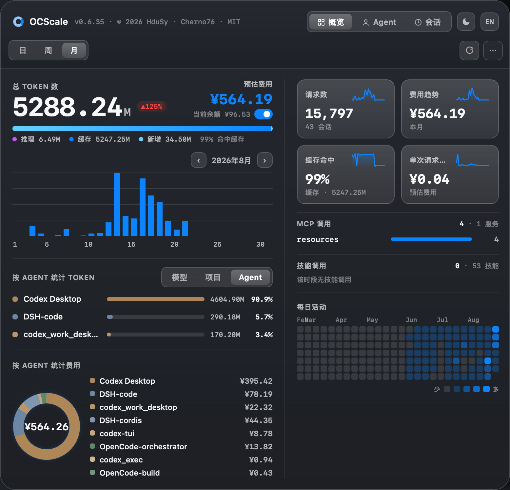

# OCScale

**English** · [中文](README-zh.md)


A **menu-bar / system-tray app for macOS and Windows** that shows your **daily token
usage and estimated cost** across OpenCode, Codex and DeepSeek Harness — with
per-model / project / agent / MCP / Skill breakdowns and your **DeepSeek account
balance** right in the panel.

Stack: **Tauri 2 + React + TypeScript** (frontend) / **Rust** (data layer).



> 100% local & read-only. The app never writes to your data, has no cloud component,
> no telemetry and no account — **single machine, private by design**.

## Features

- **Menu-bar label**: today's token count (e.g. `⬡ 14.00M`) next to the icon; on
  Windows the same number is shown in the tray tooltip, since the tray API has no
  text label
- **Tray label mode**: toggle between today's tokens and the **DeepSeek balance**
  (e.g. `¥12.34`) — both the menu-bar title and the tooltip follow
- **Panel** (click the tray icon): Day / Week / Month, each compared against the
  previous period with a percentage delta; Week / Month have ‹ › paging
- **Metrics**: total tokens (input / cache / output / reasoning), estimated cost,
  requests / sessions, cache-hit % and cost-per-request sparklines
- **Breakdowns**: by **model**, **project**, **agent**, **MCP call**, **Skill call** —
  with a cost donut (hover for a single entry) and a ~26-week activity heatmap
- **DeepSeek balance**: the hero shows `当前余额` (current balance) next to the
  estimated cost; enter your DeepSeek API key once in the panel — it is stored
  locally (`0600`), never logged, and only used to query the balance endpoint
- **Day boundary**: switch the Day view / tray "today" between the **local calendar
  day** and the **UTC platform day** used by DeepSeek's usage dashboard
- Tabs: **Overview / Agents / Sessions**
- **Only your own MCP servers / Skills are counted** — all OpenCode built-in tools
  are filtered out
- Extras: 100M-token milestone confetti, save panel screenshot to Desktop, launch-at-
  login preference, dark / light / system theme, EN / 中文 UI
- macOS: the panel is a floating NSPanel that stays above fullscreen apps without
  stealing focus

## Data sources (zero-intrusion)

The app only ever **reads** local data — it never writes to or modifies it.

| Purpose | Source |
|---------|--------|
| OpenCode messages (tokens / model / tool calls) | OpenCode SQLite DB — `$XDG_DATA_HOME/opencode/opencode.db` or `~/.local/share/opencode/opencode.db` |
| Codex messages (tokens / MCP) | `~/.codex/sessions/**` + `~/.codex/archived_sessions/**` JSONL transcripts |
| DeepSeek Harness messages (tokens / MCP) | `~/.dsh/sessions/**/session.jsonl[.zstd]` (or `$DSH_HOME/sessions`), zstd-decompressed |
| User MCP whitelist | `~/.config/opencode/opencode.json` → `mcp` object keys |
| User Skill whitelist | `~/.config/opencode/skills/` directory |
| Model prices | **Primary**: [models.dev](https://models.dev/api.json) → **Fallback**: [LiteLLM](https://raw.githubusercontent.com/BerriAI/litellm/main/model_prices_and_context_window.json) → built-in snapshot. Cached in `~/Library/Caches/ocscale/` (platform cache dir), refreshed every 24h, offline fallback |
| DeepSeek balance | `GET https://api.deepseek.com/user/balance` — key entered in the panel, cached 5 min |

### Pricing

- Prices are matched by exact model name, then a normalized name (strip vendor
  prefix + `.`↔`p`, e.g. `glm-5.1`⇄`glm-5p1`); the official bare-name price wins
- **Built-in DeepSeek override** (in `pricing.rs`): official `deepseek-v4-flash` /
  `deepseek-v4-pro` rates in CNY with a **Beijing-time peak / off-peak split**
  (peak = 09:00–12:00 and 14:00–18:00, UTC+8, no DST):

  | Model | Off-peak (miss / hit / output) | Peak (miss / hit / output) |
  |-------|--------------------------------|----------------------------|
  | `deepseek-v4-flash` | ¥1.5 / ¥0.05 / ¥4.5 per 1M | ¥3.0 / ¥0.10 / ¥9.0 per 1M |
  | `deepseek-v4-pro`   | ¥4.5 / ¥0.15 / ¥13.5 per 1M | ¥9.0 / ¥0.30 / ¥27.0 per 1M |

  The rate is picked from each event's timestamp; cache-write tokens bill at the
  cache-miss input rate. Values are stored in USD at the zh UI's fixed 7.2 rate so
  `cost × 7.2` shows exact CNY.
- Models not found in any source still count tokens but are labelled **"no price"**;
  OpenCode's own per-message `cost` field is used as a fallback for unrecognised
  models.
- Cost is an **estimate** based on public prices — treat it as "equivalent spend
  value".

### Key processing

- One **assistant message** = one event; per-message timestamps give accurate hourly
  charts, while session-level metadata (agent, project, title) comes from the
  `session` / `project` tables
- Token split: `input` (uncached) / `cache` (write + read) / `output` / `reasoning`;
  the UI folds cache into "In" and shows a separate "cached %"
- Codex: per-turn tokens come from `token_count` (the session-level
  `total_token_usage` is cumulative → deltas); `input_tokens` already includes
  `cached_input_tokens`, so uncached input = input − cached
- DeepSeek Harness: `usage` maps directly (its `inputTokens` is already uncached —
  no subtraction), plus `cr` / `cc` / `reasoning` fields
- Tool classification: `{server}_{tool}` names whose prefix is in your OpenCode
  config → MCP; the `skill` tool's `state.input.name` matching your skills directory
  → Skill; built-in tools (`read`, `write`, `edit`, `bash`, `grep`, `glob`, `task`,
  `todowrite`, `question`, `webfetch`, …) are ignored

#### Token types & cost formula

Every assistant message's `tokens` object reports mutually exclusive counts:

| Stage | DB field | What it is |
|-------|----------|------------|
| **Input** (uncached) | `tokens.input` | New prompt tokens sent this turn |
| **Cache write** | `tokens.cache.write` | Context written into the prompt cache |
| **Cache read** (hit) | `tokens.cache.read` | Context replayed from the cache |
| **Output** | `tokens.output` | Tokens the model generated |
| **Reasoning** | `tokens.reasoning` | Reasoning tokens, billed at the output rate |

```
total = input + cache.write + cache.read + output + reasoning

cost  = input       × p.input
      + cache.write × p.cache_create
      + cache.read  × p.cache_read    # cache hits billed at the discounted read rate
      + output      × p.output
      + reasoning   × p.output
```

Cache hits are **not** billed as normal input — they use the dedicated (cheaper)
`cache_read` rate, which is why heavily-cached usage shows a large token count but a
modest cost.

## Install

Download the latest release from
[GitHub Releases](https://github.com/Cherno76/ocscale/releases) (`.dmg` on macOS,
NSIS `.exe` on Windows), or build from source (below).

Because builds are **unsigned / unnotarized**:

- **macOS**: Gatekeeper blocks the first launch — right-click the app → **Open** →
  confirm, or run `xattr -cr /Applications/OCScale.app` once
- **Windows**: SmartScreen warns on first run — click **More info → Run anyway**

The app installs per-user, registers launch-at-login, and starts in the menu bar /
tray (no Dock icon, no window at launch).

## Develop

```bash
pnpm install
pnpm tauri dev         # launch the desktop app (requires the Rust toolchain)
```

Frontend-only preview (uses a real-data snapshot `public/dev-dashboard.json`, which is
gitignored and machine-specific):

```bash
pnpm dev               # http://localhost:1420
# refresh the snapshot:
cd src-tauri && cargo run --example dump > ../public/dev-dashboard.json
```

Rust unit tests:

```bash
cargo test -p ocscale
```

## Build

```bash
pnpm tauri build       # .app / .dmg on macOS, .exe (NSIS) on Windows
```

Artifacts land in `src-tauri/target/release/bundle/`. CI builds on `git push --tags`
with a `v*` tag; the macOS leg also updates the Homebrew Cask tap.

## Structure

```
core/                 ocscale-core crate — shared aggregation (RawEvent → Dashboard)
  store.rs            OpenCode SQLite → RawEvent (+ tool-call classification)
  store_codex.rs      Codex transcripts → RawEvent
  store_dsh.rs        DeepSeek Harness session logs → RawEvent
  parser.rs           aggregation (Day/Week/Month + heatmap)
  pricing.rs          models.dev / LiteLLM price loading and costing
  config.rs           user MCP / Skill whitelist
  model.rs            data structures returned to the frontend
src/                  React frontend (5 files)
  data.ts             types + Tauri bridge + theme + formatting
  charts.tsx          chart primitives (bars / donut / sparkline / heatmap / segmented)
  App.tsx             main panel
  i18n.ts             EN/ZH dictionaries
  main.tsx            entry

src-tauri/src/        Rust app backend
  lib.rs              Tauri commands + menu-bar tray + NSPanel
  balance.rs          DeepSeek balance
  main.rs             entry
```

## Bug log

Notable bugs found during development — symptom, root cause, and fix — are
collected in [docs/BUGFIXES.md](docs/BUGFIXES.md).

## License

[MIT](LICENSE) © 2026 HduSy, Cherno76
